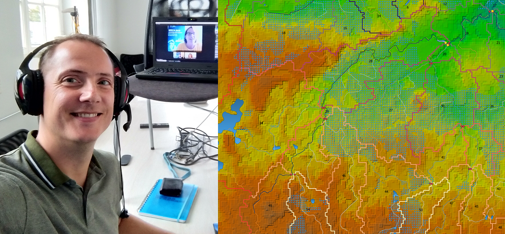

# 30-day Map Challenge 2020

## `#30DayMapChallenge` 2020 categories

Starting November 1st!

Publish a map each day with the following themes. No restriction on tools or data, but all maps should be made by you. Doing less than 30 is fine too.

https://twitter.com/tjukanov/status/1311568912950140930

## Copyright and License

All creative materials (texts, maps, images, data) are shared under [Creative Commons Attributions License](https://creativecommons.org/licenses/by/4.0/)!

All softare and codes is made available under the permissive MIT License.

https://allixender.github.io/30MapChallenge2020/
