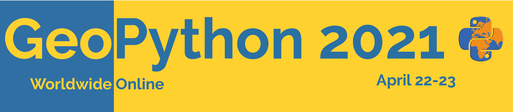
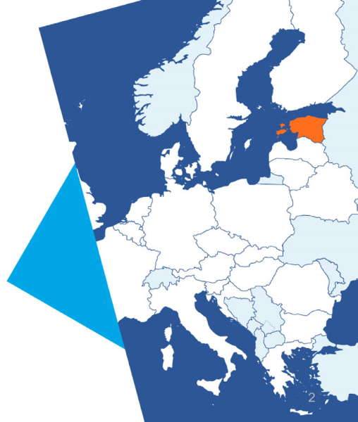
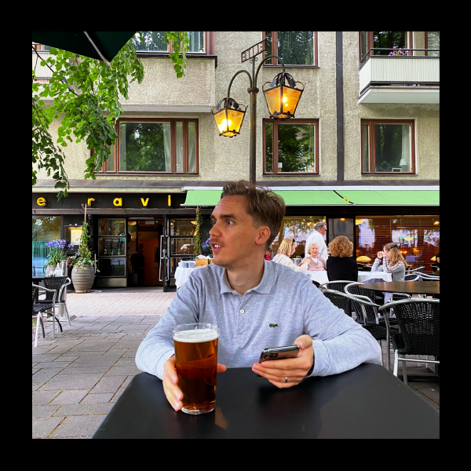
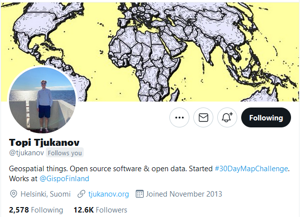
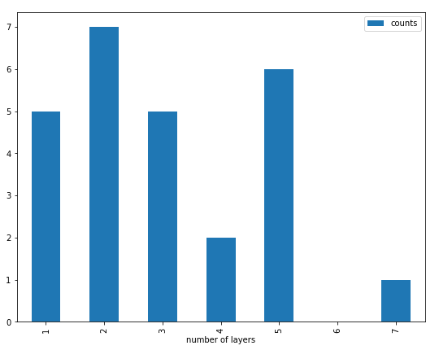
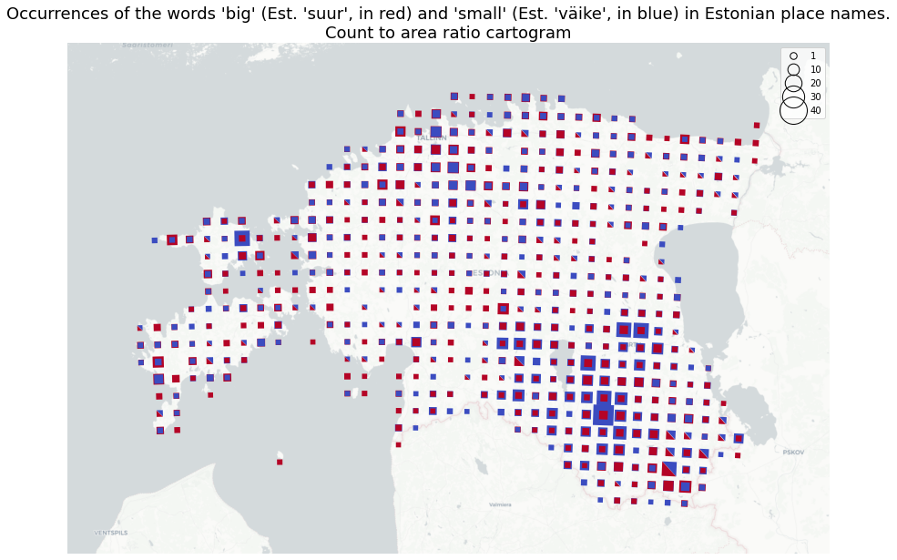
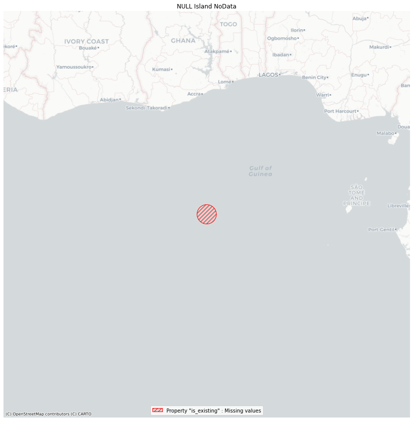
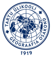

30 Maps in 30 Days
==================

.. revealjs_slide::
    :theme: league

with Python

Alexander Kmoch
---------------

- Research Fellow
- Department of Geography
- University of Tartu, Estonia

- https://kodu.ut.ee/~kmoch/

.. revealjs_break::
    :notitle:

- Topi & Challenge
- Map themes
- Concepts
- Libraries
- Lessons learned

Topi Tjukanov
-------------

`https://tjukanov.org/ <https://tjukanov.org/>`_

.. revealjs_break::

`@tjukanov <https://twitter.com/tjukanov>`_

.. revealjs_break::
    :notitle:

https://twitter.com/hashtag/30DayMapChallenge

.. image:: _static/mapchallenge.png
    :scale: 80

Somebody even made an inventory
-------------------------------

https://david.frigge.nz/30DayMapChallenge2020/

- 2019: at least 631 people tweeting on the hashtag / indexed 3484 maps by 414 people.
  - 25 people creating all 30 maps

- 2020: at least 1378 people tweeting on the hashtag. / indexed 6882 maps by 797 people.
  - 67 people creating all 30 maps

Geospatial Python and Pyviz FTW
-------------------------------

.. revealjs_section::
    :data-background-iframe: https://pyviz.org/tools.html
    :data-background-interactive:

.. revealjs_break::
    :notitle:

`https://allixender.github.io/30MapChallenge2020/ <https://allixender.github.io/30MapChallenge2020/>`_

- Github repo
- Sphinx :-)
- Notebooks + (most) data, at least data cites
- reproducible

Challenges
----------

**Idea + Data + Skill → Good Map**

- Open Data related to themes (cool idea?)
- Too much/big data hard to effectively churn into a nice map
- Styling options (existing vs. known vs. skill)

Concepts
--------

- data acquisition
- pre-processing
- spatial analysis (sometimes)
- plotting and styling

Libraries and how I used them
-----------------------------

**produce the image**

- Geopandas.plot aka Matplotlib - 11
- GeoPlot - 5
- GeoViews / cartopy - 4
- EarthPy - 4
- Python PILLOW, raw image/gifs - 3
- Datashader - 2
- folium - 1

.. revealjs_break::

**data acquisition and pre-processing**

- Geopandas
- Rasterio/GDAL
- Contextily (as a basemap)
- requests / urllib.requests
- Owslib
- osmnx

.. revealjs_break::

**spatial analysis**

- Shapely/Geopandas clip, sjoin or otherwise subselect - 7
- Pysal (MapClassify) - 6
- GeoPlot functions (KDE, cartogram) - 4
- EarthPy (Hillshade) - 3
- DGGS grids - 3
- pysheds - 1
- idw_knn interpolation - 1
- pymannkendall - 1

.. revealjs_break::

**number of layers**

.. revealjs_break::
    :notitle:

.. figure:: ../../../source/_static/day-01-points.png
    :scale: 40

    Classic Points: Estonian State Forest Management Centre (RMK) public recreations sites

.. revealjs_break::
    :data-background-color: #FFFFFF
    :notitle:

.. figure:: ../../../source/_static/day-18-landcover.png
    :scale: 40

    Classic GIS: Landuse Copernicus C3S Landcover for Estonia

.. revealjs_break::
    :notitle:

.. figure:: ../../../source/_static/day-29-globe.png
    :scale: 50

    Natural Earth population as Globe with GeoViews

.. revealjs_break::
    :notitle:

.. figure:: ../../../source/_static/day-04-hexa.png
    :scale: 50

    Hexagons: NASA GPWv4 global population density in ISEAH7 DGGS Hexagons

.. revealjs_break::
    :notitle:

.. figure:: ../../../source/_static/day-10-grids.png
    :scale: 40

    Grids - comparison of different global grid systems (H3, rHealPix, dggrid4py)

.. revealjs_break::
    :data-background-color: #FFFFFF
    :notitle:

.. figure:: ../../../source/_static/day-06-red.png
    :scale: 50

    Red DEM shading of Mars (EarthPy)

.. revealjs_break::
    :notitle:

.. figure:: ../../../source/_static/day-11-3d.png
    :scale: 50

    3D Elevation as scientific surface plot

.. revealjs_break::
    :data-background-color: #FFFFFF
    :notitle:

.. figure:: ../../../source/_static/day-09_monochrome.png
    :scale: 60

    Monochrome theme: Stream Delineation with PySheds

.. revealjs_break::
    :data-background-color: #FFFFFF
    :notitle:

.. figure:: ../../../source/_static/day-21-water.png
    :scale: 40

    Trends in River flows in Estonia (pymannkendall)

.. revealjs_break::
    :notitle:

.. figure:: ../../../source/_static/antartica-10-days.gif
    :scale: 50

    Change of Sea ice extent around Antarctica Nov. 2020

.. revealjs_break::
    :notitle:

.. figure:: ../../../source/_static/day-17-historical.gif
    :scale: 60

    Historical Maps of the Estonian Island of Vormsi - Owslib WMS

.. revealjs_break::
    :notitle:

.. figure:: ../../../source/_static/day-05-blue.png
    :scale: 50

    GeoPlot KDE - Blue Cornflower distribution

    The Blue Cornflower is also a National Estonian symbol.

.. revealjs_break::
    :data-background-color: #FFFFFF
    :notitle:

    Big or (and) small: Place names containing *big* / *small*

.. revealjs_break::
    :data-background-color: #FFFFFF
    :notitle:

.. figure:: ../../../source/_static/day-23-boundaries.png
    :scale: 60

    GeoPlot Cartograms: Boundaries as global countries bboxes

Day 26 - Map with a new tool
----------------------------

#TODO

Day 28 - Non-geographic map
---------------------------

#TODO

.. revealjs_break::
    :notitle:

    NULL Island NoData

.. revealjs_break::
    :data-background-color: #000000
    :notitle:

.. figure:: ../../../source/_static/day-02-river-lines.png
    :scale: 40

    Datashader: Estonian rivers and streams by from Estonian Landboard (Maa-Amet)

.. revealjs_break::
    :data-background-color: #000000
    :notitle:

.. figure:: ../../../source/_static/day-22-movement.png
    :scale: 60

    Datashader - Movement / Mobility in Estonia

.. revealjs_break::
    :data-background-color: #000000
    :notitle:

.. figure:: ../../../source/_static/day-07-green.png
    :scale: 40

    Green Radar Style Buildings Footprint (OSMNX)

.. revealjs_break::
    :data-background-color: #000000
    :notitle:

.. figure:: ../../../source/_static/day-12-ascii-globe.png
    :scale: 40

    Map not made with GIS software (ASCII art)

Conclusions
-----------

It was awesome!

It was slightly insane.

I learned sooo much!

Gotta do it again.

.. revealjs_break::
    :notitle:

Thanks.

alexander.kmoch@ut.ee

twitter.com/allixender

twitter.com/lgeoinformatics

