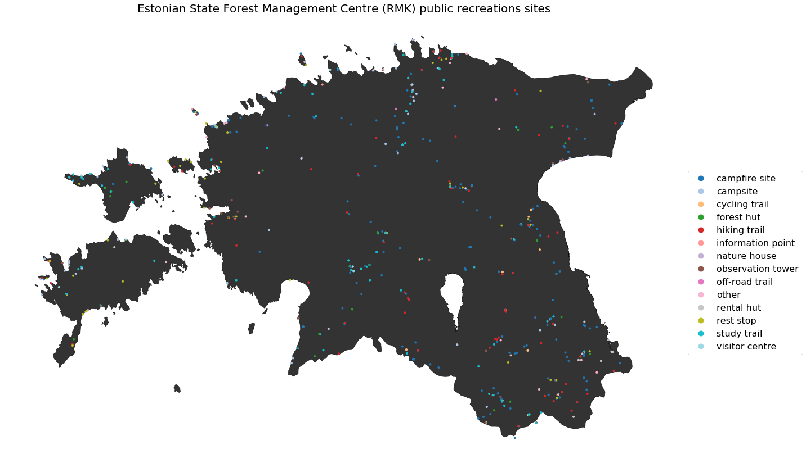

Day 01 - Points: Estonian State Forest Management Centre (RMK) public recreations sites
=======================================================================================

https://twitter.com/allixender/status/1323001798647578625

Data
----

- points of interests from RMK API via downloader:

https://github.com/tambeta/rmkmapper

https://loodusegakoos.ee/kuhuminna

https://loodusegakoos.ee/where-to-go

Basic Geopandas mapping :-)

https://geopandas.org/mapping.html

The Jupyter notebook `(view here) <https://nbviewer.jupyter.org/github/allixender/30MapChallenge2020/blob/main/01/day-01.ipynb>`_ is provided in my `GitHub repo <https://github.com/allixender/30MapChallenge2020/tree/main/01>`_.
