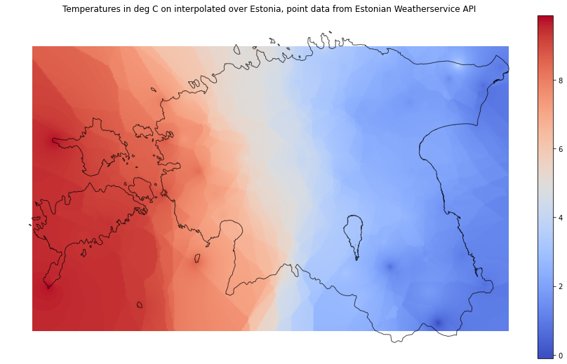

Day 13 - Raster Interpolation
-----------------------------

https://twitter.com/tjukanov/status/1311568912950140930

Data
~~~~

- Estonian Weatherservice XML ticker

- interpolated via a fancy IDW substitute: cKDTree from scipy.spatial

http://www.ilmateenistus.ee/ilma_andmed/xml/observations.php

The Jupyter notebook `(view here) <https://nbviewer.jupyter.org/github/allixender/30MapChallenge2020/blob/main/13/day-13.ipynb>`_ is provided in my `GitHub repo <https://github.com/allixender/30MapChallenge2020/tree/main/13>`_.
